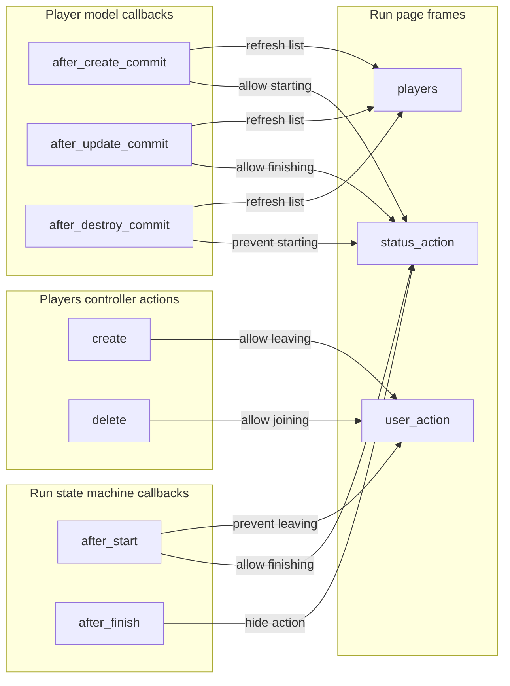

```mermaid
graph LR
subgraph B["Run page frames"]
  B1[players]
  B2[user_action]
  B3[status_action]
end

subgraph D[Player model callbacks]
  D1[after_create_commit] --> |refresh list| B1
  D1 --> |allow starting| B3
  D2[after_update_commit] --> |refresh list| B1
  D2 -->|allow finishing| B3
  D3[after_destroy_commit] --> |refresh list| B1
  D3 --> |prevent starting| B3
end

subgraph A[Run state machine callbacks]
  A1[after_start] -->|prevent leaving| B2
  A1 -->|allow finishing| B3
  A2[after_finish] -->|hide action| B3
end

subgraph C[Players controller actions]
  C1[create] -->|allow leaving| B2
  C2[delete] -->|allow joining| B2
end
```
